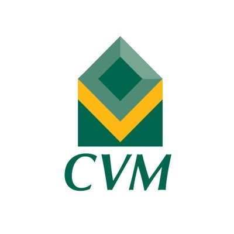

# Gabriel Rocha

Hello World! My name is Gabriel Rocha. I am a frontend developer from **São Gonçalo**:brazil: living in **Brasília**:brazil:. I have Bachelor's degree in Computer Science from Unicarioca and I am passionate about tech. My main technologies are React and Typescript and in my free time I like to participate in coding competitions and solve algorithmic problems.

## Work experience

**Technology Agent (Mar 2022 - Present)**  
[**Banco do Brasil**](https://www.bb.com.br)  
`React Native` `Typesscript` `Javascript`

**.NET Developer Intern (Jul 2018 - Jun 2020)**          
[**Comissão de Valores Mobiliários**](https://www.gov.br/cvm)  
`.NET` `C#` `Visual Basic .NET` `Javascript` `CSS` `HTML`

## Github Stats

## Most used languages

